# Multiplayer-FPS

A multiplayer first-person shooter game based on Unity3D. Different types of input devices are supported, including Kinect, Xbox controllers, Leap motion, and VR Glasses. (Each contained in a different branch, *UPDATE: those are not maintained since 2020, use at your own risk*)

## Requirement

[Unity 2022.3.55f1 (LTS)](https://unity.cn/release-notes/lts/2022/2022.3.55f1)

## Game logic and functionality

* Login panel
  * Input your **player name** and the **room name** you want to join
  * Click **'join or create room'** button to join a room or create a new room
  * The network connection state shows on the bottom left corner
    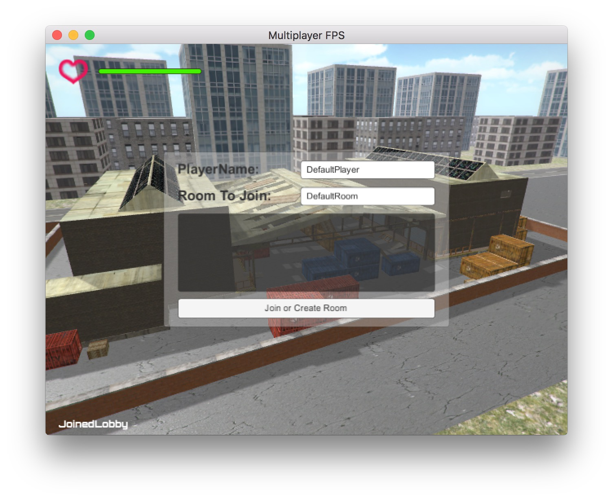

* Game interface
  * **Player's HP** on the top left corner
  * The **message panel** on the bottom left corner, which shows status of other players (e.g. dead or respawn)
  * A **gun (AK-47)** is always shown on the bottom right corner in front of every thing you can see
  * A red **shooting sight** is always in the center of the screen
  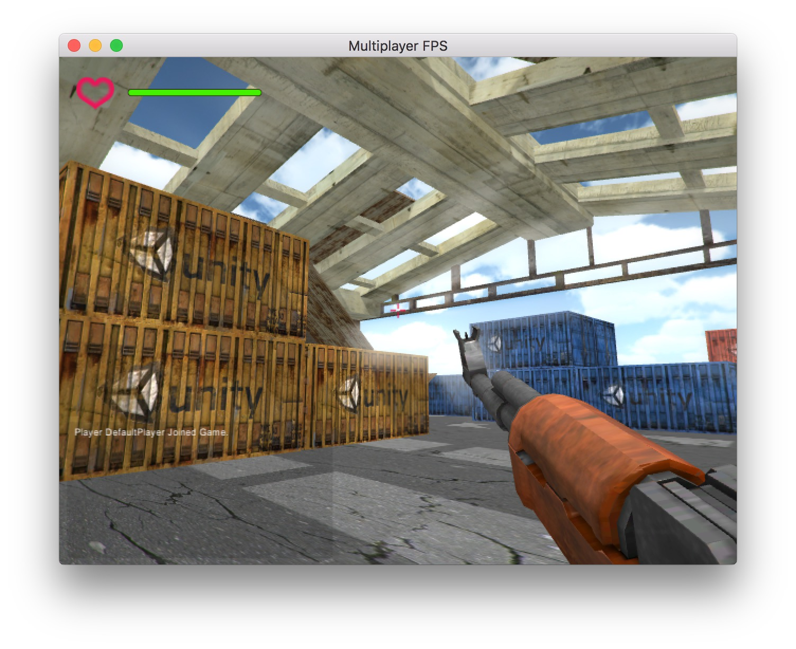</img>

* Player models
  * All the original models and their animations were found from **[Mixamo](https://www.mixamo.com/)**, which is a pretty good game model website run by Adobe
  * There are three types of player **models**:
    * **Policeman**: a policeman-like model with yellow skin
    * **RobotX**: a robot-like model with dark pink skin
    * **RobotY**: a robot-like model with dark blue skin
    * 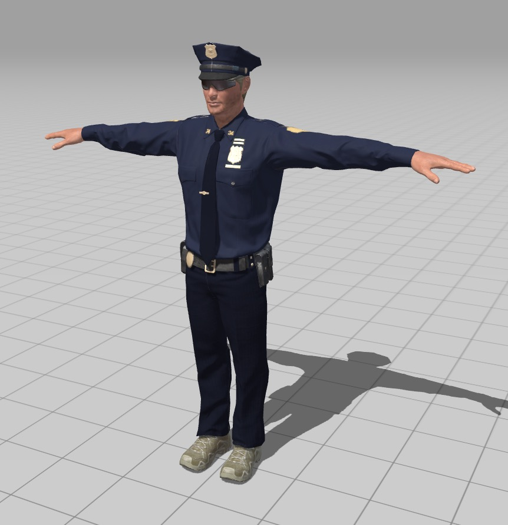</img> 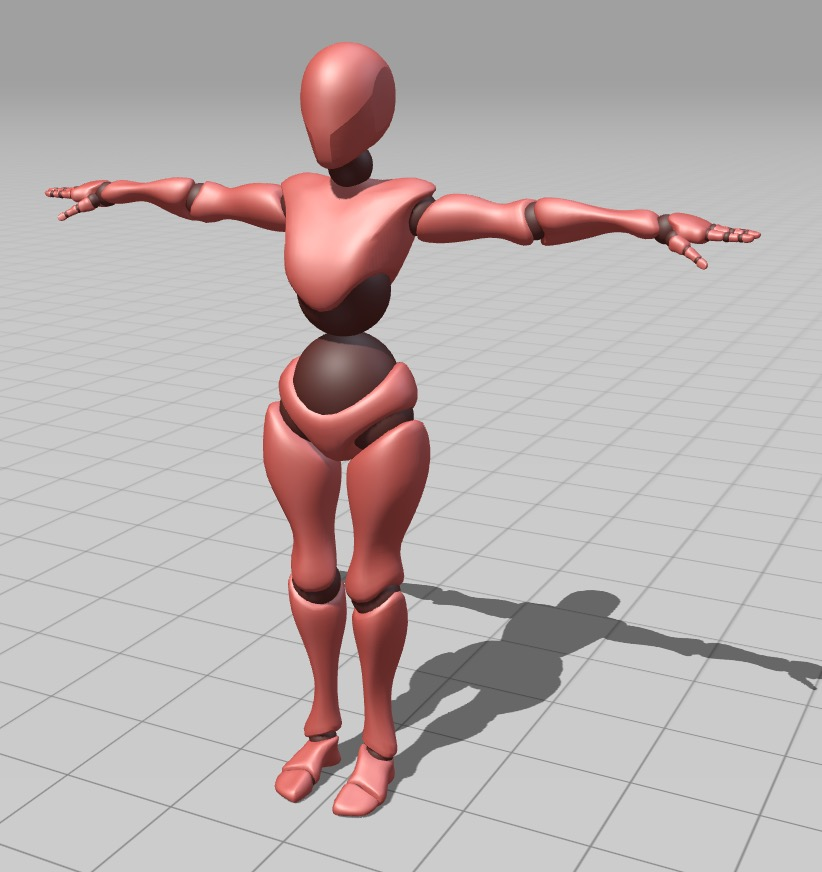</img> 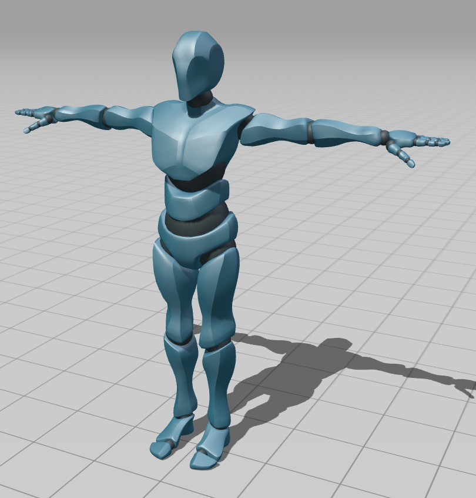</img>

  * **Animations**:
    * **Walk** towards four different directions
    * **Run** towards four different directions
    * **Jump** without affecting upper part body (**achieved by unity3d body mask**)
    * **Shoot** without affecting lower part body (**achieved by unity3d body mask**)
    * **Unity Blend Tree**
      * This makes the player walk or run more naturally. It uses interpolation function to map different combinations of user input to different animations.
      * 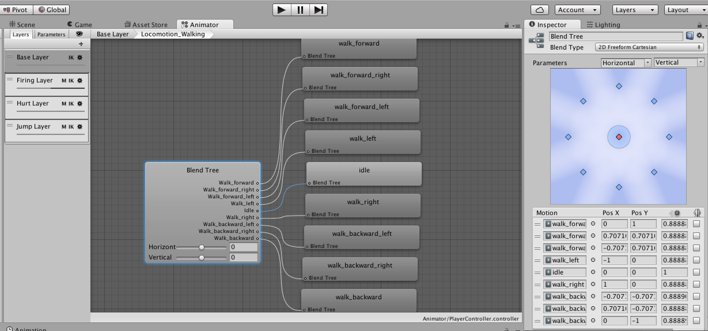

  * **State Machine**
    * There are multiple layers in the player state machine.
    * 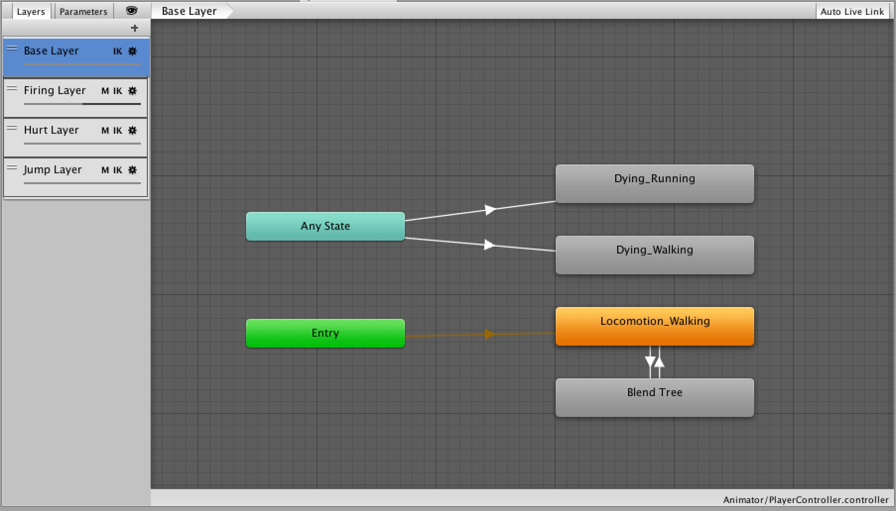</img>
    * 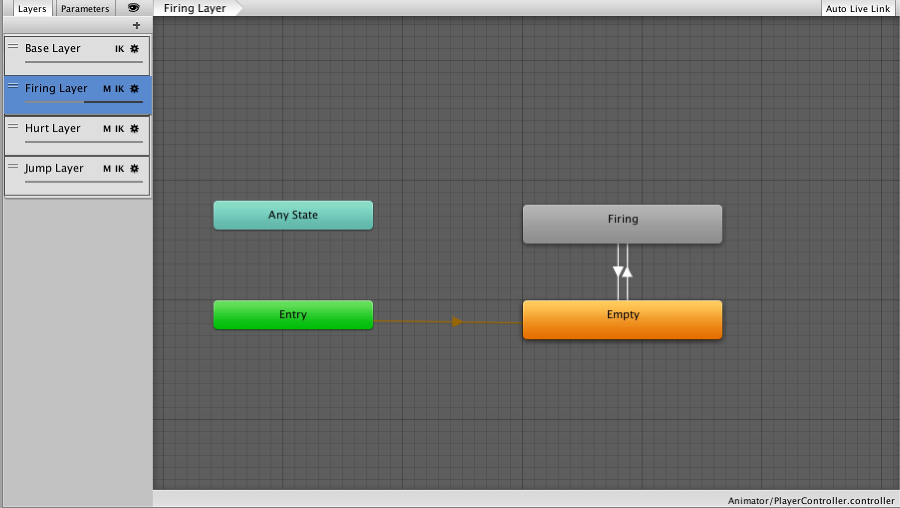</img>
    * 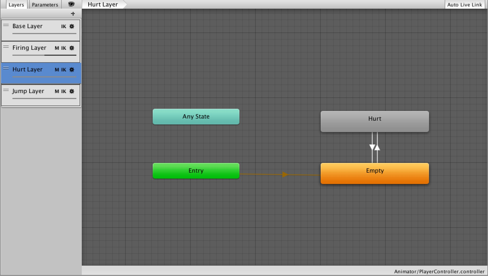</img>
    * 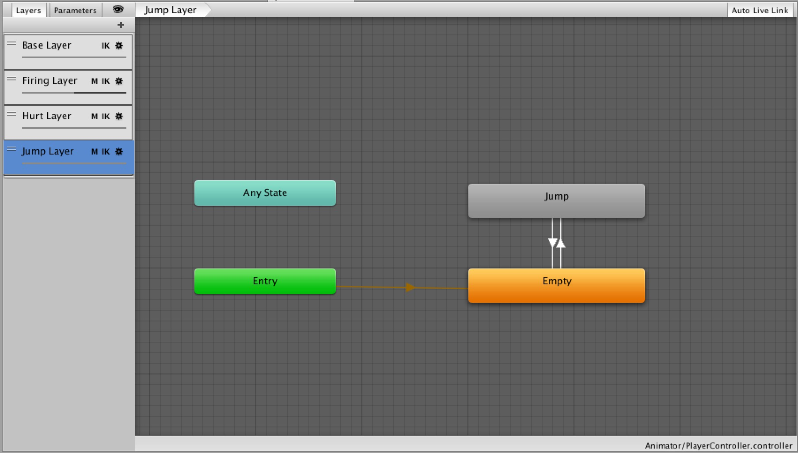</img>

* Player movement
  * Walking && Running && Aiming
    * </img>
    * </img>
    * </img>
    * </img>
  * Jumping
    * </img>
  * Dying
    * </img>
    * </img>

* Gun model
  * The original gun model (AK-47) was from Unity Assets Store
  * **Shooting animation are added** by setting keyframes in unity3d animation panel
  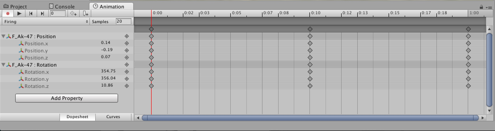

* Networking
  * This game uses **Photon Unity Networking 2**, which is a good network model from Unity Assets Store

* Bullet effects
  * Bullets hitting different materials will cause different effects
    * Wood
    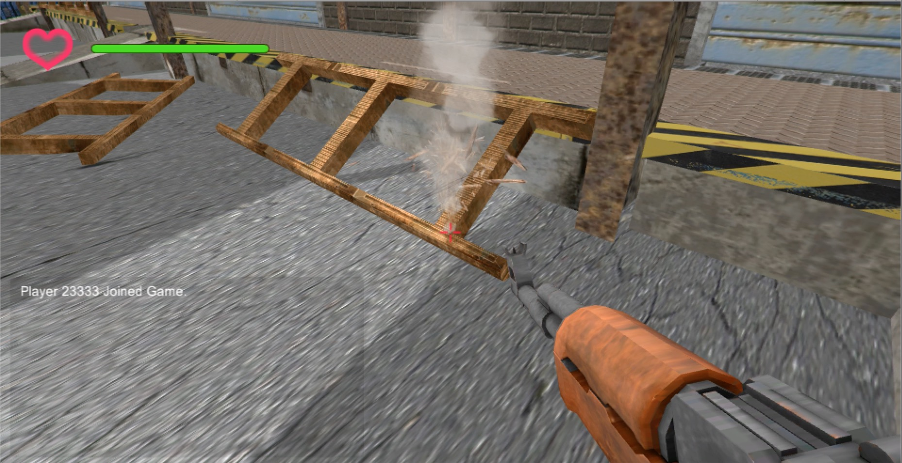</img>
    * Ground
    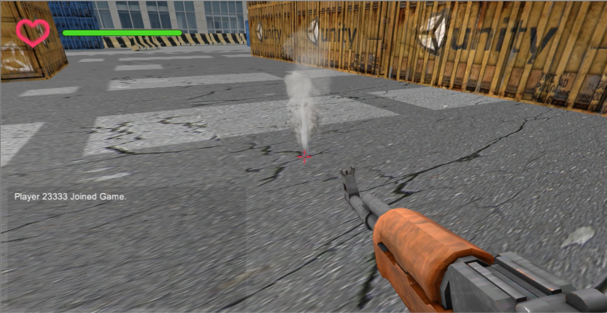</img>
    * Metal
    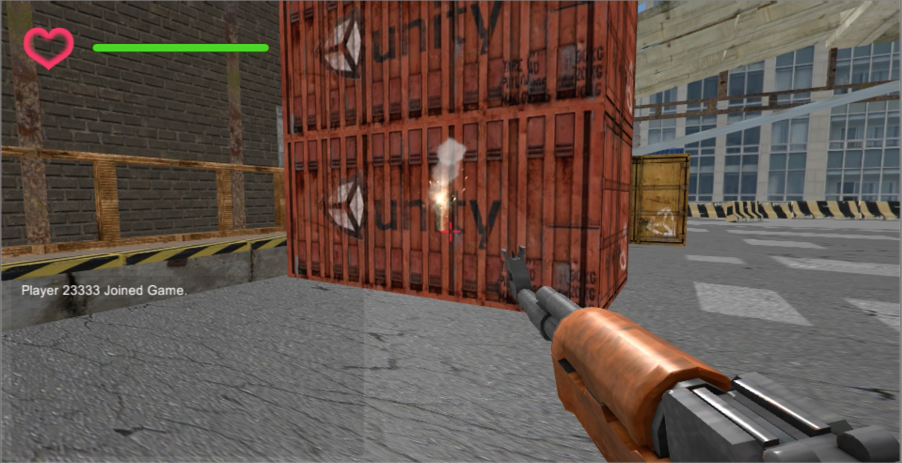</img>
    * Concrete
    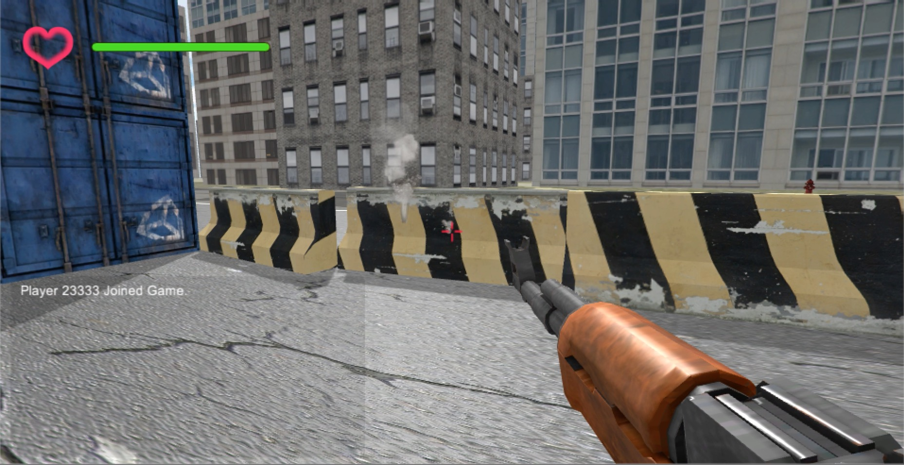</img>
    * Water
    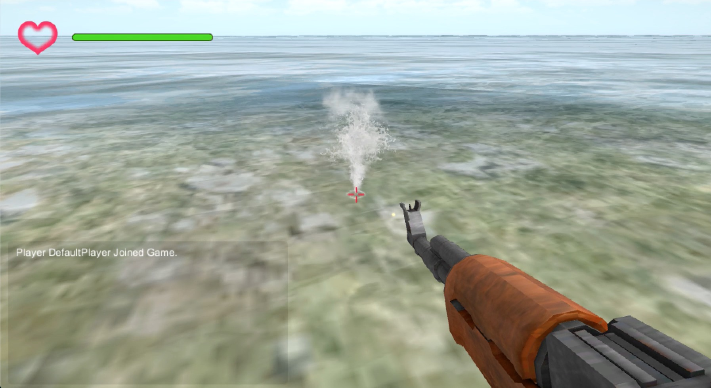</img>

* Door animation
  * Doors will automatically open when there is someone nearby and close when no one is around
  * Before opening
  </img>
  * After opening
  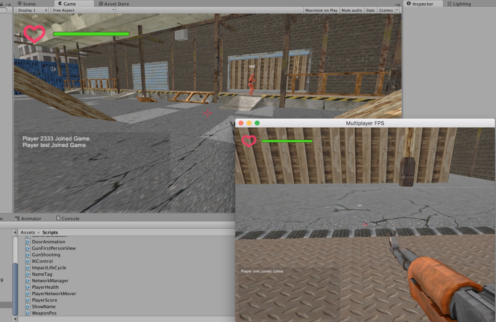</img>

## Script files

* **CameraRotation.cs**
  * Rotates the scene camera in every updated frame
* **DoorAnimtion.cs**
  * Controls the door animation and detect if the player enters or exits the door triggering area
* **FpsGun.cs**
  * Controls the gun in first person view, mainly for shooting
* **TpsGun.cs**
  * Controls the gun in third person view (replicated on network), mainly transform and particle effects
* **IKControl.cs**
  * Ensures the model is holding a gun regardless of movements or rotations
* **ImpactLifeCycle.cs**
  * Destroys the bullet object after several seconds to save CPU time and memory
* **NameTag.cs**
  * Displays other players' names above their heads
* **NetworkManager.cs**
  * Controls the whole network connection
* **PlayerHealth.cs**
  * Calculates and updates health points of each player
* **PlayerNetworkMover.cs**
  * Synchronizes the position of the player among different clients

### Input Devices

* Mouse and keyboard
  * The traditional way
  * Cheap and easy to use
* Kinect
  * See below for details
  * *This part was implemented by my friend [Ruochen Jiang](https://github.com/VHUCXAONG), many thanks to him!*
* Xbox Controller
  * Like the combination of mouse and keyboard
  * Most Xbox games use this way to play
* Leap Motion
  * User hand gesture to control game
  * A more advanced interaction that might become popular in the future
* VR glasses
  * More vivid and closer to reality
  * Recently very popular but devices are most likely expensive
  * Players cannot move now due to the limitation of my device

### Kinect Details

* Tools and Platform:
  * Kinect for Xbox One
  * Kinect for Windows SDK
  * Unity
  * Visual Studio

* Recognition Method:
  * Use Kinect for Windows SKD (BodySourceManager) to get the positions of the player's skeleton. Determine the actions of moving, jumping, shooting based on these positions and regard rotation as an input of the game.

* **Shooting**：
  * Users can trigger shooting by lifting their right arms. The game calculates the distance between the user's right hand and right shoulder based on skeleton nodes. Shooting will be triggered if the calculated distance reaches a threshold.

* **Moving**:
  * Move in the game by stepping forward, backward, leftward, and rightward. The game recognizes moving actions by the offset of right foot’s skeleton node on x-z plane. A movement will be triggered if the offset reaches a threshold.

* **Jumping**:
  * Users can jump in the game. The game calculates offset of right foot’s skeleton node on the z-axis to register a jumping action. Jumping will be triggered if the calculated offset reaches a threshold.

* **View Rotation**:
  * Use your right hand as a virtual mouse to control the camera rotation. The game records the initial position of the left hand as the initial position of the mouse, then calculates the camera rotation by the left hand’s offset.

*  </img>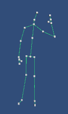</img> 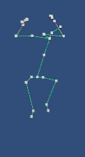 </img>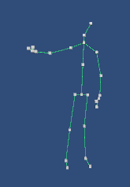</img>

## Contribution

See [CONTRIBUTING.md](https://github.com/Armour/Multiplayer-FPS/blob/master/.github/CONTRIBUTING.md)

## License

[MIT License](https://github.com/Armour/Multiplayer-FPS/blob/master/LICENSE)
